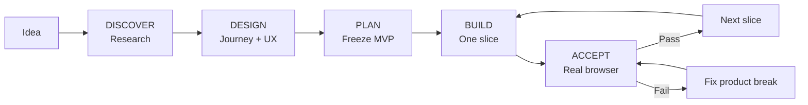

# Web Product Vibe

> **Turn a rough idea into a usable web product — not just a working backend.**

[简体中文](README.zh-CN.md) · [Quick Start](docs/QUICK_START.md) · [Workflow](docs/WORKFLOW.md) · [Design Principles](docs/DESIGN_PRINCIPLES.md) · [GitHub Setup](docs/GITHUB_SETUP.md)


**Web Product Vibe** is a product-first skill for AI coding agents. It is designed for non-programmers and vibe coders who can describe what they want, but need the AI to research comparable products, shape the UX, freeze scope, implement in small vertical slices, and verify the result through a real browser before calling it done.

The core problem it targets is simple:

> AI coding often produces a technically working system with a weak product experience: the backend exists, but the user journey, UI states, feedback, persistence, and next steps do not line up.

Web Product Vibe makes **product truth come before technical truth**.

## Why this exists

Typical AI coding flow:

```text
Idea → Big plan → Backend/API/DB → Build passes → Open the UI → Product feels wrong → Patch loop
```

Web Product Vibe:

```text
Idea → Comparable-project research → User journey → UX/state design → Scope freeze
     → Technical plan → Small vertical slice → Real-browser acceptance → Next slice
```

The goal is not more process. The goal is **less rework**.

## What it does

| Mode | Purpose |
|---|---|
| `DISCOVER` | Research active / relevant GitHub projects and comparable products before deciding the solution |
| `DESIGN` | Define target user, core journey, screens, interactions, states, failure recovery and next steps |
| `PLAN` | Freeze MVP and non-goals, then derive the minimum technical design and vertical slices |
| `BUILD` | Implement one bounded end-to-end slice instead of swallowing the whole project |
| `ACCEPT` | Verify the product through a real browser / Playwright-equivalent user journey |
| `CHANGE` | Decide whether a new idea belongs now, next version, parking lot, or should replace something |
| `AUDIT` | Find front/back disconnects, misleading UI states, missing persistence and product dead ends |

## The hard rule

For Web/UI work, none of these alone means **DONE**:

- API returns 200
- database write succeeds
- unit tests pass
- lint / typecheck / build pass
- code review looks good

A feature is complete only when a real user journey works through a real browser (or Playwright-equivalent), including UI feedback, backend effect, persistence, refresh, failure recovery and a clear next step.

If that evidence is missing, the result is `INSUFFICIENT EVIDENCE` or `CONDITIONAL PASS` — not `DONE`.

## Supported agents

One canonical skill powers all three hosts:

- **Codex** → install to `.agents/skills/web-product-vibe/`
- **DeepSeek Harness** → install to `.agents/skills/web-product-vibe/`
- **Claude Code** → install to `.claude/skills/web-product-vibe/`

No host-specific workflow logic is required. If a host lacks web search, browser automation, or another capability, the skill preserves the workflow and reports the missing evidence instead of pretending it was verified.

## Quick start

### Windows

```powershell
# Install for all three hosts into an existing project
.\install.ps1 -HostType all -ProjectRoot "D:\your-project"

# Or choose one host
.\install.ps1 -HostType codex -ProjectRoot "D:\your-project"
.\install.ps1 -HostType claude -ProjectRoot "D:\your-project"
.\install.ps1 -HostType dsh -ProjectRoot "D:\your-project"
```

### macOS / Linux

```bash
./install.sh all /path/to/your-project
```

Existing installations are backed up before replacement.

Then start naturally:

```text
Use web-product-vibe. Enter DISCOVER.
My project idea is ...
Research comparable active GitHub projects first. Focus on product, user journey, UX/UI,
technical choices and trade-offs. Do not write code yet.
```

For the full flow, see [Quick Start](docs/QUICK_START.md).

## 30-second workflow



A new idea during implementation does **not** silently enter scope. Route it through `CHANGE` first.

## Designed for

- non-programmers building web products with AI coding agents
- solo makers / vibe coders who frequently change ideas during development
- projects where backend capability exists but the UI/product experience keeps breaking
- greenfield projects that need GitHub/reference research before planning
- existing projects that need a product-first audit rather than another architecture rewrite

## Not trying to be

- a full agile framework
- a replacement for your repository rules (`AGENTS.md`, `CLAUDE.md`, etc.)
- a UI component library
- a backend architecture framework
- an excuse to create dozens of planning documents

It intentionally stays small: one core skill, a few templates, and a browser-verified completion rule.

## Repository layout

```text
web-product-vibe/
├─ skill/web-product-vibe/       # Single source of truth
│  ├─ SKILL.md
│  ├─ references/
│  └─ templates/
├─ docs/                         # Human-facing guides
├─ platforms/                    # Codex / Claude Code / DeepSeek Harness notes
├─ examples/                     # Example usage
├─ tools/check_skill.py          # Package validation
├─ install.ps1                   # Windows installer
├─ install.sh                    # macOS/Linux installer
├─ CHANGELOG.md
├─ CONTRIBUTING.md
├─ LICENSE
└─ VERSION
```

## Design philosophy

1. **Product truth before technical truth.**
2. **User journey before architecture.**
3. **Observable behavior before internal implementation.**
4. **Reference projects are solution libraries, not automatic requirements.**
5. **One version, one primary user outcome.**
6. **Prefer the smallest reversible implementation.**
7. **Real-browser acceptance is required for Web/UI completion.**

More detail: [Design Principles](docs/DESIGN_PRINCIPLES.md).

## Inspiration

This project is an independent synthesis of public development patterns. It does not bundle or copy the upstream frameworks.

Conceptually inspired by:

- [BMad Method](https://github.com/bmad-code-org/BMAD-METHOD) — progressive product → UX → architecture → implementation flow
- [GitHub Spec Kit](https://github.com/github/spec-kit) — WHAT before HOW, structured specifications
- [OpenSpec](https://github.com/Fission-AI/OpenSpec) — lightweight scope agreement and change governance
- [AI Coding Project Boilerplate](https://github.com/shinpr/ai-coding-project-boilerplate) — UI specification, focused agents and E2E acceptance patterns

See `skill/web-product-vibe/references/INSPIRATION.md` for details.

## Status

**v0.3.0 — early public release.** The skill package and installers are statically validated, but host behavior can evolve as Codex, Claude Code and DeepSeek Harness change their skill systems.

## Contributing

Small, testable improvements are preferred over framework expansion. See [CONTRIBUTING.md](CONTRIBUTING.md).

## License

MIT — see [LICENSE](LICENSE).
