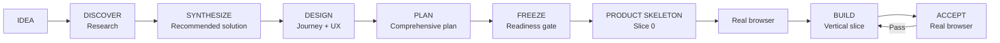

# Web Product Vibe

> **Turn a rough idea into a usable Web product through research, solution synthesis, product design, a complete project plan, vertical delivery, and real-browser acceptance.**

[简体中文](README.zh-CN.md) · [Quick Start](docs/QUICK_START.md) · [Workflow](docs/WORKFLOW.md) · [Design Principles](docs/DESIGN_PRINCIPLES.md) · [Generic Agent Guide](platforms/GENERIC_AGENT.md) · [GitHub Setup](docs/GITHUB_SETUP.md)


**Web Product Vibe** is a product-first skill for non-programmers and vibe coders using AI coding agents.

It addresses two common failures:

1. Researching many GitHub projects but never turning the findings into one coherent product decision.
2. Producing a technically complete backend while the frontend, user journey, state, persistence, security, and delivery plan remain incomplete or stale.

The workflow is:

```text
IDEA
→ DISCOVER: comparable products/projects
→ SYNTHESIZE: our recommended solution
→ DESIGN: user journey, screens, interactions, states
→ PLAN: comprehensive project plan
→ FREEZE: readiness + scope contract
→ Product Skeleton: clickable Slice 0
→ BUILD: vertical full-stack slices
→ ACCEPT: real-browser gate per slice
→ Full E2E
→ DONE
```

The goal is not more process. The goal is **to move expensive rework into earlier, cheaper decisions and validation**.

## Eight modes

| Mode | Purpose |
|---|---|
| `DISCOVER` | Research active/relevant GitHub projects and comparable products |
| `SYNTHESIZE` | Turn research into one recommended solution: adopt, adapt, reject, park, and explain why |
| `DESIGN` | Define user journey, screens, interactions, states, recovery, and next steps |
| `PLAN` | Generate the comprehensive project execution contract and readiness verdict |
| `BUILD` | Implement Product Skeleton or one complete vertical slice; backend-first completion is forbidden by default |
| `ACCEPT` | Verify the real user journey in a browser / Playwright-equivalent environment |
| `CHANGE` | Decide whether a new idea belongs now, next version, parking lot, or should replace something |
| `AUDIT` | Find stale UI, front/back drift, misleading state, persistence gaps, and permission/security mismatches |

## Research does not go straight into implementation

`DISCOVER` answers “How do comparable products/projects work?”

`SYNTHESIZE` must then answer:

- What problem are we actually solving?
- What is confirmed fact vs interpretation vs assumption?
- Which ideas should we adopt, adapt, reject, or park?
- Which approaches are genuinely viable?
- What is the recommended solution and why?
- What must be true for it to work?
- What is the biggest likely failure mode?
- What evidence would change the recommendation?

If a critical assumption could change the product direction or architecture, validate it with the **lowest-cost reversible reality check** instead of continuing to debate it.

## PLAN means a comprehensive project plan, not a backend architecture memo

For a non-trivial new project or major redesign, PLAN covers all applicable dimensions before implementation:

- product goal, target user, MVP, non-goals, boundaries
- user journey, information architecture, screens, UX states
- frontend architecture, routes, components, state, responsive/accessibility behavior
- backend architecture, APIs/services/workflows, business rules, error semantics
- data model, source of truth, read/write paths, lifecycle, migration, backup/recovery
- AI/Agent boundaries, human review, eval, cost, and failure strategy where applicable
- security/privacy/auth/authorization/secrets/input/upload/URL/prompt-injection boundaries where applicable
- third-party dependencies and degradation strategy
- engineering/module boundaries and configuration
- reliability, retry, idempotency, concurrency, cancellation, partial success
- logging, diagnostics, auditability, observability
- unit/integration/contract/browser E2E testing
- deployment, migration, smoke, rollback, compatibility
- performance/cost budgets where material
- Product Skeleton
- vertical implementation slices
- front/back sync contract
- browser acceptance and final DONE definition
- main risks, exit conditions, and rollback criteria

Irrelevant sections are marked `N/A` with a reason. The skill should neither omit important dimensions nor invent complexity to make the plan look sophisticated.

## Freeze first, then execute Product Skeleton

Once the plan is `READY`, implementation begins with Product Skeleton (Slice 0) for non-trivial new UI work:

- core routes/screens
- real navigation
- primary actions and next steps
- representative empty/loading/success/error states
- fixtures/mocks where real capabilities are not wired yet
- responsive behavior where required

Then run a real-browser Skeleton Gate before broad backend implementation.

This catches “the whole journey is wrong” while it is still cheap to fix.

## “Keep going” must not become backend-first execution

Autonomous execution is supported:

```text
Frozen plan
→ Product Skeleton
→ browser PASS
→ Slice 1: frontend + backend + persistence + recovery
→ browser PASS
→ Slice 2
→ browser PASS
→ ...
```

Not allowed as the default for interactive Web work:

```text
all DB → all APIs → all agents → all tests → UI at the end
```

If a slice fails, fix the smallest blocker, re-run acceptance, then continue.

## Completion model

- **Backend PASS** — backend/data/business behavior is correct
- **Frontend PASS** — page/interaction/state/navigation behavior is correct
- **Slice DONE** — Backend PASS + Frontend PASS + real-browser acceptance for the same user-observable behavior
- **Project DONE** — the frozen core user journey passes full E2E

API 200, DB writes, unit tests, lint, typecheck, build, and schema checks do not individually prove Web product completion.

## Model-agnostic and agent-host-neutral

The canonical Skill is **not tied to GPT, Claude, DeepSeek, Gemini, Qwen, Kimi, or any other model family**. The model is not the main integration boundary; the coding host / agent harness is.

Any coding agent can use the core workflow when it can load the Skill (or equivalent persistent project instructions) and expose the tools needed for the requested mode.

Capability levels:

- **Instructions/context only** → planning modes can still work.
- **Repository + file + shell/test access** → practical `BUILD` support.
- **Real browser / Playwright-equivalent access** → full Web/UI `ACCEPT` and honest `DONE` evidence.
- **Web/GitHub research access** → live `DISCOVER` research.

The repository currently maintains explicit adapters/examples for:

- **Codex** → `.agents/skills/web-product-vibe/`
- **DeepSeek Harness** → `.agents/skills/web-product-vibe/`
- **Claude Code** → `.claude/skills/web-product-vibe/`

These are **maintained adapters, not an exclusive compatibility list**. For any other coding agent or future harness, see [Generic / Any-Agent Compatibility](platforms/GENERIC_AGENT.md).

If a host lacks a required capability, preserve the workflow and report missing evidence instead of pretending verification passed.

## Quick start

### Maintained installers

#### Windows

```powershell
.\install.ps1 -HostType all -ProjectRoot "D:\your-project"
```

Host choices: `codex` / `claude` / `dsh` / `all`.

#### macOS / Linux

```bash
./install.sh all /path/to/your-project
```

### Any other coding agent

Copy the canonical folder `skill/web-product-vibe/` into that host's Skill / rules / project-instructions location, keeping `SKILL.md`, `references/`, and `templates/` together. If the host has no formal Skill system, expose `SKILL.md` as persistent project instructions and keep the sibling files accessible.

Start with:

```text
Use web-product-vibe. Enter DISCOVER.
My project idea is ...
Research comparable active/new GitHub projects and products.
Compare user, journey, UX/UI, technical choices and trade-offs.
Keep verified facts separate from inference. Do not write code yet.
```

Then:

```text
Enter SYNTHESIZE.
Turn the research into our own recommended solution.
Explain what to adopt, adapt, reject, or park; list critical assumptions,
failure/exit conditions, and what evidence would change the recommendation.
```

Then:

```text
Enter DESIGN, then PLAN.
Generate the full project plan and readiness verdict before implementation.
After the plan is frozen, continue Product Skeleton → vertical slices → browser acceptance.
```

See [Quick Start](docs/QUICK_START.md) for the full pattern.

## 30-second workflow



New ideas during implementation do not silently enter scope. Route them through `CHANGE`.

## Designed for

- non-programmers building Web products with AI coding agents
- users of any model-backed coding agent or harness that can load project instructions/Skills
- Codex / Claude Code / DeepSeek Harness users via maintained adapters
- people who research GitHub projects before designing their own solution
- projects that need a complete cross-functional plan before autonomous execution
- “keep going until done” workflows that still need product gates
- projects where backend capability advances while UI/product truth stays stale

## Not trying to be

- a heavyweight agile framework
- a replacement for repository rules such as `AGENTS.md` or `CLAUDE.md`
- a UI component library
- a backend architecture framework
- an excuse to generate dozens of documents

The goal is simple: **make existing AI coding agents better at delivering complete Web products, not merely more code.**

## Repository layout

```text
web-product-vibe/
├─ skill/web-product-vibe/
│  ├─ SKILL.md
│  ├─ references/
│  └─ templates/
│     ├─ SOLUTION_PROPOSAL.md
│     ├─ PROJECT_PLAN.md
│     └─ ...
├─ docs/
├─ platforms/
│  ├─ GENERIC_AGENT.md
│  ├─ CODEX.md
│  ├─ CLAUDE_CODE.md
│  └─ DEEPSEEK_HARNESS.md
├─ examples/
├─ tools/check_skill.py
├─ install.ps1
├─ install.sh
├─ CHANGELOG.md
├─ CONTRIBUTING.md
├─ LICENSE
└─ VERSION
```

## Design philosophy

1. Separate facts, interpretations, goals, constraints, and assumptions.
2. Research is not a decision; synthesize a recommendation.
3. User journey before architecture.
4. Comprehensive project plan before implementation.
5. Product Skeleton before heavy backend work.
6. Vertical slices before horizontal technical layers.
7. “Keep going” does not mean “finish backend first.”
8. Reference projects are solution libraries, not automatic requirements.
9. One version, one primary user outcome.
10. Real-browser evidence is required for Web/UI DONE.
11. The core workflow is model-agnostic; tool capability determines what can be honestly verified.

More detail: [Design Principles](docs/DESIGN_PRINCIPLES.md).

## Status

**v0.3.0 — early public release.** The core workflow is model-agnostic and host-neutral. Codex, Claude Code, and DeepSeek Harness have maintained installation adapters in this repository; other hosts use the generic integration contract and may require host-specific placement/configuration.

## Contributing

Small, testable improvements are preferred over framework expansion. See [CONTRIBUTING.md](CONTRIBUTING.md).

## License

MIT — see [LICENSE](LICENSE).