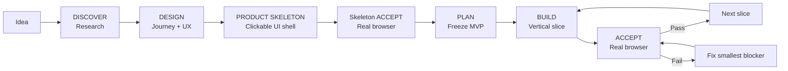

# Web Product Vibe

> **Turn a rough idea into a usable web product — not just a working backend.**

[简体中文](README.zh-CN.md) · [Quick Start](docs/QUICK_START.md) · [Workflow](docs/WORKFLOW.md) · [Design Principles](docs/DESIGN_PRINCIPLES.md) · [GitHub Setup](docs/GITHUB_SETUP.md)


**Web Product Vibe** is a product-first skill for AI coding agents. It is designed for non-programmers and vibe coders who can describe what they want, but need the AI to research comparable products, shape the UX, validate a runnable product skeleton, freeze scope, implement in vertical slices, and verify the result through a real browser before calling it done.

The core problem it targets is simple:

> AI coding often produces a technically working backend while the frontend still represents an older workflow. APIs, database writes and tests pass, but the real user journey is confusing, stale or broken.

Web Product Vibe makes **product truth come before technical truth** and keeps frontend, backend and persisted state on the same user journey.

## Why this exists

A common failure mode:

```text
Idea
→ Big plan
→ All database / APIs / agents / backend
→ Tests pass
→ Frontend comes last
→ UI still reflects the old product
→ Technical chain works, user journey does not
→ Large rework loop
```

Web Product Vibe:

```text
Idea
→ Comparable-project research
→ User journey + UX
→ Product Skeleton (clickable UI shell)
→ Real-browser Skeleton Gate
→ Freeze MVP
→ Technical plan
→ Slice 1: frontend + backend + persistence + browser acceptance
→ Slice 2
→ ...
→ Full E2E
```

The goal is not more process. The goal is **less front/back drift and less rework**.

## New: Product Skeleton (Slice 0)

For a non-trivial new Web product or major UI redesign, create a runnable product shell before substantial backend implementation:

- core routes/screens
- real navigation
- primary actions and next steps
- representative empty/loading/success/error states
- fixtures/mocks when real capabilities are not wired yet
- responsive behavior where required

Then run a real-browser / Playwright-equivalent Skeleton Gate.

This is not fake completion. It is an early, cheap way to detect that the whole journey, navigation or interaction model is wrong before the backend becomes expensive to change.

## “Keep going” must not become backend-first execution

Web Product Vibe supports autonomous execution. An agent can continue through an approved plan without waiting for manual confirmation between slices.

But “do not stop” has a precise meaning:

> **Continue the validated product sequence — do not finish every backend layer first and postpone the frontend until the end.**

Preferred sequence:

```text
Product Skeleton
→ browser PASS
→ Slice 1 frontend + backend + persistence
→ browser PASS
→ Slice 2
→ browser PASS
→ ...
```

If a slice fails, fix the smallest blocking product issue, re-run acceptance, then continue.

## What it does

| Mode | Purpose |
|---|---|
| `DISCOVER` | Research active / relevant GitHub projects and comparable products before deciding the solution |
| `DESIGN` | Define target user, core journey, screens, interactions, states, failure recovery and Product Skeleton |
| `PLAN` | Freeze MVP and non-goals, then derive the minimum technical design and vertical slices |
| `BUILD` | Build Product Skeleton or one complete vertical slice; backend-first completion is not allowed by default |
| `ACCEPT` | Verify the product through a real browser / Playwright-equivalent user journey |
| `CHANGE` | Decide whether a new idea belongs now, next version, parking lot, or should replace something |
| `AUDIT` | Find front/back drift, stale UI, misleading states, missing persistence and product dead ends |

## Three completion layers

Web Product Vibe separates:

- **Backend PASS** — backend/data/business behavior is correct
- **Frontend PASS** — page/interaction/state/navigation behavior exists
- **Slice DONE** — Backend PASS + Frontend PASS + real-browser acceptance for the same user-observable behavior

A strong backend does not make the project done if the frontend still represents an older product version.

## The hard rule

For Web/UI work, none of these alone means **DONE**:

- API returns 200
- database write succeeds
- unit tests pass
- lint / typecheck / build pass
- code review looks good

A feature is complete only when a real user journey works through a real browser (or Playwright-equivalent), including UI feedback, backend effect, persistence, refresh, failure recovery and a clear next step.

If that evidence is missing, the result is `INSUFFICIENT EVIDENCE` or `CONDITIONAL PASS` — not `DONE`.

## Supported agents

One canonical skill powers all three hosts:

- **Codex** → install to `.agents/skills/web-product-vibe/`
- **DeepSeek Harness** → install to `.agents/skills/web-product-vibe/`
- **Claude Code** → install to `.claude/skills/web-product-vibe/`

No host-specific workflow logic is required. If a host lacks web search, browser automation, or another capability, the skill preserves the workflow and reports the missing evidence instead of pretending it was verified.

## Quick start

### Windows

```powershell
# Install for all three hosts into an existing project
.\install.ps1 -HostType all -ProjectRoot "D:\your-project"

# Or choose one host
.\install.ps1 -HostType codex -ProjectRoot "D:\your-project"
.\install.ps1 -HostType claude -ProjectRoot "D:\your-project"
.\install.ps1 -HostType dsh -ProjectRoot "D:\your-project"
```

### macOS / Linux

```bash
./install.sh all /path/to/your-project
```

Then start naturally:

```text
Use web-product-vibe. Enter DISCOVER.
My project idea is ...
Research comparable active GitHub projects first. Focus on product, user journey, UX/UI,
technical choices and trade-offs. Do not write code yet.
```

For autonomous execution later:

```text
Continue through the frozen plan without waiting for manual confirmation.
Still follow Product Skeleton → vertical slice → real-browser acceptance.
Each slice must complete frontend + backend + persistence + recovery before moving on.
Do not finish all backend layers first and patch the UI at the end.
```

For the full flow, see [Quick Start](docs/QUICK_START.md).

## 30-second workflow



A new idea during implementation does **not** silently enter scope. Route it through `CHANGE` first.

## Designed for

- non-programmers building web products with AI coding agents
- users of Codex / Claude Code / DeepSeek Harness
- autonomous “keep going until done” workflows that still need product gates
- projects where backend capability advances but the UI stays stale
- greenfield projects that need GitHub/reference research before planning
- existing projects that need a product-first audit rather than another architecture rewrite

## Not trying to be

- a full agile framework
- a replacement for repository rules (`AGENTS.md`, `CLAUDE.md`, etc.)
- a UI component library
- a backend architecture framework
- an excuse to create dozens of planning documents

It intentionally stays small: one core skill, a few templates, a Product Skeleton gate, vertical slices, and browser-verified completion.

## Repository layout

```text
web-product-vibe/
├─ skill/web-product-vibe/       # Single source of truth
│  ├─ SKILL.md
│  ├─ references/
│  └─ templates/
├─ docs/                         # Human-facing guides
├─ platforms/                    # Codex / Claude Code / DeepSeek Harness notes
├─ examples/                     # Example usage
├─ tools/check_skill.py          # Package validation
├─ install.ps1                   # Windows installer
├─ install.sh                    # macOS/Linux installer
├─ CHANGELOG.md
├─ CONTRIBUTING.md
├─ LICENSE
└─ VERSION
```

## Design philosophy

1. **Product truth before technical truth.**
2. **User journey before architecture.**
3. **Product Skeleton before heavy backend implementation.**
4. **Vertical slices before horizontal technical layers.**
5. **“Keep going” does not mean “finish backend first.”**
6. **Reference projects are solution libraries, not automatic requirements.**
7. **One version, one primary user outcome.**
8. **Real-browser acceptance is required for Web/UI completion.**

More detail: [Design Principles](docs/DESIGN_PRINCIPLES.md).

## Status

**v0.3.0 — early public release.** The skill package and installers are statically validated, but host behavior can evolve as Codex, Claude Code and DeepSeek Harness change their skill systems.

## Contributing

Small, testable improvements are preferred over framework expansion. See [CONTRIBUTING.md](CONTRIBUTING.md).

## License

MIT — see [LICENSE](LICENSE).
