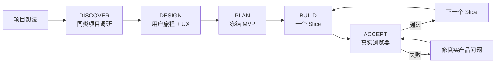

# Web Product Vibe

> **把一个模糊想法做成“真实用户能顺畅用完”的 Web 产品，而不只是做出一个后端能跑的系统。**

[English](README.md) · [快速开始](docs/QUICK_START.md) · [完整工作流](docs/WORKFLOW.md) · [设计原则](docs/DESIGN_PRINCIPLES.md) · [GitHub 发布建议](docs/GITHUB_SETUP.md)


**Web Product Vibe** 是给非程序员 / Vibe Coding 用户用的“产品优先”AI Coding Skill。

它解决的不是“AI 不会写代码”，而是一个更常见的问题：

> 后端、API、数据库都做出来了，测试也过了，但真实用户打开页面以后仍然不知道怎么用；前端状态、交互反馈、持久化、失败恢复和后端业务语义对不上，最后只能不断返工。

这个 Skill 强制把顺序改成：**先想清楚用户怎么用，再决定技术怎么做。**

## 为什么做它

常见 AI Coding：

```text
想法 → 大项目书 → API / 数据库 / 后端 → Build PASS → 最后打开页面体验
     → 发现产品不对 → 前后端一起返工 → 继续补丁
```

Web Product Vibe：

```text
想法 → GitHub/同类产品调研 → 用户旅程 → 页面与交互 → 冻结 MVP
     → 技术方案 → 一个纵向 Slice → 真实浏览器验收 → 再继续下一个 Slice
```

目的不是增加流程，而是**减少返工和无效 Token 消耗**。

## 7 个工作模式

| 模式 | 解决什么 |
|---|---|
| `DISCOVER` | 先找近期维护、活跃、有参考价值的 GitHub / 同类产品，取长补短 |
| `DESIGN` | 定真实用户、用户旅程、页面、交互、状态、失败恢复和下一步 |
| `PLAN` | 冻结 MVP / 非目标，再倒推最小技术方案和纵向 Slice |
| `BUILD` | 一次只实现一个完整小闭环，不让模型一口吞整个项目 |
| `ACCEPT` | 用真实浏览器 / Playwright 等价方式验收用户旅程 |
| `CHANGE` | 新想法先判断：现在做 / 下版 / 停车场 / 替换现有方案 |
| `AUDIT` | 专门找前后端断裂、页面状态失真、刷新丢失、交互死路 |

## 最重要的硬规则

对于 Web / UI 功能，下面这些**都不能单独代表 DONE**：

- API 200
- 数据库写入成功
- Unit Test PASS
- Lint / Typecheck / Build PASS
- Code Review 没发现问题

必须从真实用户入口，通过真实浏览器（或 Playwright 等价方式）完整走通核心旅程，并确认：

**页面反馈正确 → 真正触发后端 → 数据正确保存 → 刷新仍正确 → 失败能恢复 → 用户知道下一步 → 前后端业务语义一致。**

缺少真实浏览器证据，只能判定 `INSUFFICIENT EVIDENCE` / `CONDITIONAL PASS`，不能宣布完成。

## 三端兼容

只维护一套核心 Skill：

- **Codex** → `.agents/skills/web-product-vibe/`
- **DeepSeek Harness** → `.agents/skills/web-product-vibe/`
- **Claude Code** → `.claude/skills/web-product-vibe/`

核心工作流不依赖某个平台独占功能。如果当前 Agent 没有 Web 搜索、真实浏览器或其他能力，必须明确缺少证据，不能假装验证通过。

## 快速安装

### Windows

```powershell
# 三端一起准备
.\install.ps1 -HostType all -ProjectRoot "D:\你的项目"

# 或只安装一个
.\install.ps1 -HostType codex -ProjectRoot "D:\你的项目"
.\install.ps1 -HostType claude -ProjectRoot "D:\你的项目"
.\install.ps1 -HostType dsh -ProjectRoot "D:\你的项目"
```

### macOS / Linux

```bash
./install.sh all /path/to/your-project
```

如果目标位置已经有旧版 Skill，安装器会先自动备份再替换。

然后直接对 AI 说：

```text
使用 web-product-vibe，进入 DISCOVER。
我的项目想法是……。
先找同类 GitHub 项目，优先近期维护、活跃、新兴且有真实产品/UI 的方案；
从产品、用户旅程、UX/UI、技术和取舍几个角度取长补短。先不要写代码。
```

完整流程见：[快速开始](docs/QUICK_START.md)。

## 30 秒看懂工作流



开发途中突然冒出来的新想法，不能直接塞进当前版本，必须先走 `CHANGE`。

## 适合谁

- 不会编程，但会描述目标、会使用 AI Coding Agent 的人
- 经常用 Codex / Claude Code / DeepSeek Harness 做 Web 项目的个人开发者
- 经常出现“后端功能有了，页面却不好用”的项目
- 想在开工前先研究 GitHub 同类项目、取长补短的人
- 已经做乱，需要从真实用户体验重新审计，而不是继续重构架构的项目

## 它不是什么

- 不是一套重型敏捷框架
- 不替代你的 `AGENTS.md` / `CLAUDE.md` / 项目规则
- 不是 UI 组件库
- 不是后端架构框架
- 不鼓励为了“显得专业”制造几十份 Markdown 文档

它故意保持很小：**一个核心 Skill + 少量必要模板 + 浏览器最终验收。**

## 项目结构

```text
web-product-vibe/
├─ skill/web-product-vibe/       # 唯一核心 Skill，三端共用
│  ├─ SKILL.md
│  ├─ references/
│  └─ templates/
├─ docs/                         # 给人看的文档
├─ platforms/                    # 三个平台安装/使用说明
├─ examples/                     # 使用示例
├─ tools/check_skill.py          # 包完整性检查
├─ install.ps1                   # Windows 安装器
├─ install.sh                    # macOS/Linux 安装器
├─ CHANGELOG.md
├─ CONTRIBUTING.md
├─ LICENSE
└─ VERSION
```

## 核心原则

1. **产品真相优先于技术真相。**
2. **用户旅程优先于架构。**
3. **用户能观察到的行为优先于内部实现。**
4. **GitHub 项目是解法库，不是需求库。**
5. **一个版本只服务一个主要用户结果。**
6. **默认最小修改、可验证、可回滚。**
7. **Web/UI 没有真实浏览器用户旅程证据，不允许 DONE。**

## 方法来源

这是独立重新整合的方法，不捆绑、不复制下面项目的代码或模板。主要借鉴公开方法：

- [BMad Method](https://github.com/bmad-code-org/BMAD-METHOD)：产品 → UX → 架构 → 实现的渐进流程
- [GitHub Spec Kit](https://github.com/github/spec-kit)：先 WHAT，再 HOW
- [OpenSpec](https://github.com/Fission-AI/OpenSpec)：轻量 Scope Freeze 与变更治理
- [AI Coding Project Boilerplate](https://github.com/shinpr/ai-coding-project-boilerplate)：UI Spec、上下文工程、E2E 验收

详细见 `skill/web-product-vibe/references/INSPIRATION.md`。

## 当前状态

**v0.3.0 — 早期公开版本。** Skill 包和安装器有静态校验，但 Codex、Claude Code、DeepSeek Harness 的 Skill 机制后续可能变化，因此平台兼容说明需要随上游更新。

## 贡献

优先接受“小、明确、可验证”的改进，不鼓励把它继续膨胀成重型框架。见 [CONTRIBUTING.md](CONTRIBUTING.md)。

## License

MIT，见 [LICENSE](LICENSE)。
