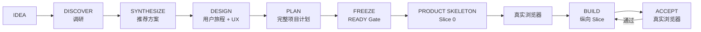

# Web Product Vibe

> **把一个模糊想法，经过调研、方案决策、产品设计和完整项目计划，做成真实用户能顺畅用完的 Web 产品。**

[English](README.md) · [快速开始](docs/QUICK_START.md) · [完整工作流](docs/WORKFLOW.md) · [设计原则](docs/DESIGN_PRINCIPLES.md) · [GitHub 发布建议](docs/GITHUB_SETUP.md)


**Web Product Vibe** 是给非程序员 / Vibe Coding 用户用的“产品优先”AI Coding Skill。

它解决的不只是“后端做完了，前端还是旧的”这一类问题，也解决更前面的一层：

> 找了一堆 GitHub 项目以后，到底该借什么、不借什么？我们自己的方案是什么？产品、前端、后端、数据、安全、边界、测试和发布到底怎么组成一份真正能执行的项目计划？

这个 Skill 把链路固定成：

```text
IDEA
→ DISCOVER：调研同类项目 / 产品
→ SYNTHESIZE：取长补短，形成自己的推荐方案
→ DESIGN：用户旅程、页面、交互、状态
→ PLAN：完整项目计划书
→ FREEZE：冻结范围与执行合同
→ Product Skeleton：先做可点击产品骨架
→ BUILD：按纵向 Slice 前后端同步实现
→ ACCEPT：每个 Slice 真实浏览器验收
→ Full E2E
→ DONE
```

目的不是增加流程，而是**把最贵的返工提前变成最便宜的判断和验证**。

## 8 个工作模式

| 模式 | 解决什么 |
|---|---|
| `DISCOVER` | 找近期维护、活跃、有真实产品/UI 参考价值的 GitHub / 同类项目 |
| `SYNTHESIZE` | 把调研结果变成我们自己的推荐方案：借什么、不借什么、为什么 |
| `DESIGN` | 定真实用户、核心旅程、页面、交互、状态、失败恢复和下一步 |
| `PLAN` | 生成完整项目计划书，并给出 READY / NOT READY |
| `BUILD` | 做 Product Skeleton 或一个完整纵向 Slice，禁止后端先行 |
| `ACCEPT` | 用真实浏览器 / Playwright 等价方式验收真实用户旅程 |
| `CHANGE` | 新想法先判断现在做 / 下版 / 停车场 / 替换现有方案 |
| `AUDIT` | 找前后端不同步、旧 UI、状态失真、刷新丢失、权限/安全语义断裂 |

## 调研之后，不直接开工

`DISCOVER` 只回答“别人怎么做”。

`SYNTHESIZE` 必须再回答：

- 真正的问题是什么
- 哪些是已确认事实，哪些只是解释或假设
- 哪些参考项目的设计值得采用 / 改造 / 拒绝 / 暂存
- 有哪些真正可行的路线
- 最推荐哪一条，为什么
- 这条路线成立的前提是什么
- 最大失败路径是什么
- 什么新证据会推翻当前结论

如果一个关键假设可能改变整个产品方向或架构，优先做**最低成本、可逆、能得到真实反馈的验证**，而不是继续讨论。

## PLAN = 完整项目计划书，不是后端技术书

对非简单新项目或大改版，`PLAN` 必须在执行前覆盖所有适用维度：

- 产品目标、用户、MVP、非目标和边界
- 用户旅程、信息架构、页面和 UX 状态
- 前端架构、路由、组件、状态、响应式、可访问性
- 后端架构、API / Service / Workflow、业务规则、错误语义
- 数据模型、Source of Truth、读写、生命周期、迁移、备份恢复
- AI / Agent 职责、模型边界、人工确认、Eval、成本和失败策略（如适用）
- 安全、隐私、认证、权限、Secrets、输入、文件、URL、Prompt Injection（如适用）
- 第三方依赖和降级策略
- 工程模块边界、配置、兼容性
- 可靠性、重试、幂等、并发、取消、部分成功
- 日志、诊断、审计、可观测性
- Unit / Integration / Contract / Browser E2E 测试
- 部署、迁移、Smoke、Rollback
- 性能 / 成本预算（如重要）
- Product Skeleton
- 纵向实施 Slice
- 前后端同步合同
- 浏览器验收和最终 DONE 标准
- 风险、退出条件和回滚条件

不适用的部分写 `N/A` 并说明原因，**不能因为不想写就漏掉，也不能为了显得专业硬造复杂度。**

## 先冻结计划，再执行 Product Skeleton

计划判定 `READY` 后才进入执行。

第一阶段不是先写数据库，而是 Product Skeleton（Slice 0）：

- 核心页面 / 路由
- 真导航
- 主按钮和下一步
- 空状态 / Loading / 成功 / 失败等代表性状态
- 真实能力没接入时可用 Fixture / Mock
- 响应式基本可用

然后先用真实浏览器验证整个产品结构。

这样能在后端还没变贵之前发现：

> 页面是不是走错了？用户能不能看懂？导航是不是错的？核心操作是不是不自然？

## “不要停”不等于“先把后端做完”

Web Product Vibe 支持 Agent 持续自主执行。

```text
冻结计划
→ Product Skeleton
→ 浏览器 PASS
→ Slice 1：前端 + 后端 + 持久化 + 失败恢复
→ 浏览器 PASS
→ Slice 2
→ 浏览器 PASS
→ ...
```

如果某个 Slice 失败，修最小阻塞问题、重新验收，再继续。

不允许：

```text
全部 DB → 全部 API → 全部 Agent → 全部测试 → 最后补 UI
```

## 三层完成标准

- **Backend PASS**：后端 / 数据 / 业务逻辑正确
- **Frontend PASS**：页面 / 交互 / 状态 / 导航正确
- **Slice DONE**：Backend PASS + Frontend PASS + 同一用户旅程的真实浏览器验收
- **Project DONE**：冻结的核心用户旅程完整 E2E 通过

API 200、数据库写入、Unit Test、Lint、Typecheck、Build、Schema PASS 都不能单独代表 Web 产品完成。

## 三端兼容

只维护一套核心 Skill：

- **Codex** → `.agents/skills/web-product-vibe/`
- **DeepSeek Harness** → `.agents/skills/web-product-vibe/`
- **Claude Code** → `.claude/skills/web-product-vibe/`

核心工作流不依赖某个平台独占功能。缺少 Web 搜索、真实浏览器或其他能力时，必须明确证据不足，不能假装验证通过。

## 快速安装

### Windows

```powershell
.\install.ps1 -HostType all -ProjectRoot "D:\你的项目"
```

也可分别使用 `codex` / `claude` / `dsh`。

### macOS / Linux

```bash
./install.sh all /path/to/your-project
```

## 推荐的第一次使用方式

```text
使用 web-product-vibe，进入 DISCOVER。
我的项目想法是……。
先研究同类 GitHub / 产品，优先近期维护、活跃、新兴且有真实产品/UI 的方案；
从用户、旅程、UX/UI、技术和取舍几个角度拆解，区分事实与推断，先不要写代码。
```

然后：

```text
进入 SYNTHESIZE。
取长补短后给我一个我们自己的推荐方案。
说明采用、改造、拒绝、暂存哪些设计；列出关键假设、失效条件和可能推翻结论的新证据。
```

再：

```text
进入 DESIGN，完成用户旅程和页面/交互设计。
然后进入 PLAN，生成完整项目计划书并做 READY Gate。
计划冻结后再按 Product Skeleton → 纵向 Slice → 浏览器验收持续执行。
```

完整示例见：[快速开始](docs/QUICK_START.md)。

## 30 秒看懂工作流



开发中出现的新想法不能直接塞进当前版本，必须先走 `CHANGE`。

## 适合谁

- 不会编程，但会描述目标、会使用 AI Coding Agent 的人
- 使用 Codex / Claude Code / DeepSeek Harness 做 Web 项目的个人开发者
- 喜欢先去 GitHub 找同类项目、取长补短的人
- 经常拿到“技术上完成、产品上不能用”结果的人
- 经常让 Agent “不要停、全部做完”，但最终发现前端没跟上的人
- 需要一份同时覆盖产品、前端、后端、数据、安全、工程和验收的完整项目计划的人

## 它不是什么

- 不是重型敏捷框架
- 不替代 `AGENTS.md` / `CLAUDE.md` / 项目规则
- 不是 UI 组件库
- 不是后端架构框架
- 不要求为了流程制造几十份 Markdown

它保持一件事不变：**让已有 AI Coding Agent 更会“做完整 Web 产品”，而不只是更会写代码。**

## 项目结构

```text
web-product-vibe/
├─ skill/web-product-vibe/
│  ├─ SKILL.md
│  ├─ references/
│  └─ templates/
│     ├─ SOLUTION_PROPOSAL.md
│     ├─ PROJECT_PLAN.md
│     └─ ...
├─ docs/
├─ platforms/
├─ examples/
├─ tools/check_skill.py
├─ install.ps1
├─ install.sh
├─ CHANGELOG.md
├─ CONTRIBUTING.md
├─ LICENSE
└─ VERSION
```

## 核心原则

1. **事实、解释、目标、约束和假设要分开。**
2. **调研不是决策；调研后必须形成自己的方案。**
3. **用户旅程优先于架构。**
4. **完整项目计划优先于实现。**
5. **Product Skeleton 优先于大规模后端实现。**
6. **纵向 Slice 优先于横向技术分层。**
7. **“不要停”不等于“先把后端做完”。**
8. **GitHub 项目是解法库，不是需求库。**
9. **一个版本只服务一个主要用户结果。**
10. **Web/UI 没有真实浏览器用户旅程证据，不允许 DONE。**

## 当前状态

**v0.3.0 — 早期公开版本。** Skill 包和安装器有静态校验，但 Codex、Claude Code、DeepSeek Harness 的 Skill 机制可能随上游变化。

## 贡献

优先接受“小、明确、可验证”的改进。见 [CONTRIBUTING.md](CONTRIBUTING.md)。

## License

MIT，见 [LICENSE](LICENSE)。