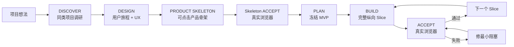

# Web Product Vibe

> **把一个模糊想法做成“真实用户能顺畅用完”的 Web 产品，而不只是做出一个后端能跑的系统。**

[English](README.md) · [快速开始](docs/QUICK_START.md) · [完整工作流](docs/WORKFLOW.md) · [设计原则](docs/DESIGN_PRINCIPLES.md) · [GitHub 发布建议](docs/GITHUB_SETUP.md)


**Web Product Vibe** 是给非程序员 / Vibe Coding 用户用的“产品优先”AI Coding Skill。

它解决的不是“AI 不会写代码”，而是更常见的问题：

> 后端、API、数据库都做出来了，测试也过了，但前端还是旧逻辑；真实用户打开页面以后不知道怎么用，页面状态、交互反馈、持久化、失败恢复和后端业务语义对不上，最后只能不断返工。

这个 Skill 强制把顺序改成：**先验证用户怎么用，再让前端、后端、数据围绕同一个用户旅程同步推进。**

## 为什么做它

最危险的 AI Coding 流程不是“代码写不出来”，而是：

```text
想法
→ 大项目书
→ 全部数据库 / API / Agent / 后端
→ 测试 PASS
→ 最后才补前端
→ 前端仍是旧版产品
→ 全链路技术上能跑，但用户根本没法用
→ 大量返工
```

Web Product Vibe：

```text
想法
→ GitHub / 同类产品调研
→ 用户旅程 + UX
→ Product Skeleton（可点击前端骨架）
→ 真实浏览器 Skeleton Gate
→ 冻结 MVP
→ 技术方案
→ Slice 1：前端 + 后端 + 数据 + 浏览器验收
→ Slice 2
→ ...
→ 完整 E2E
```

目的不是增加流程，而是**减少“后端已经新版本、前端还停在旧版本”的返工**。

## 新增：Product Skeleton（Slice 0）

对于非简单 Web 新项目或大 UI 改版，在大规模后端开发之前，先做一个可运行的产品骨架：

- 核心页面 / 路由
- 真导航
- 主按钮和下一步
- 代表性的空状态 / Loading / 成功 / 失败
- 必要时用 Fixture / Mock 表达尚未接入的真实能力
- 响应式基本可用

然后必须真实浏览器走通核心产品结构。

这一步不是“假装做完”，而是为了在最便宜的时候发现：

> 页面是不是走错了？用户能不能看懂？导航是不是错的？核心操作是不是根本不自然？

## “不要停”也不能变成后端先行

Web Product Vibe 支持让 Agent 持续自主执行，不需要你每个阶段守在电脑前确认。

但“不要停”有明确含义：

> **持续执行已经批准的产品顺序，而不是先把所有后端做完，再统一补前端。**

正确方式：

```text
Product Skeleton
→ 浏览器 PASS
→ Slice 1 前端 + 后端 + 持久化
→ 浏览器 PASS
→ Slice 2
→ 浏览器 PASS
→ ...
```

如果某个 Slice 失败，Agent 应修最小阻塞问题、重新验收，然后继续，而不是跳过去堆后端。

## 7 个工作模式

| 模式 | 解决什么 |
|---|---|
| `DISCOVER` | 先找近期维护、活跃、有参考价值的 GitHub / 同类产品，取长补短 |
| `DESIGN` | 定真实用户、用户旅程、页面、交互、状态、失败恢复，并设计 Product Skeleton |
| `PLAN` | 冻结 MVP / 非目标，再倒推最小技术方案和纵向 Slice |
| `BUILD` | 做 Product Skeleton 或一个完整纵向 Slice，不允许“全部后端先做” |
| `ACCEPT` | 用真实浏览器 / Playwright 等价方式验收用户旅程 |
| `CHANGE` | 新想法先判断：现在做 / 下版 / 停车场 / 替换现有方案 |
| `AUDIT` | 专门找前后端不同步、旧 UI、状态失真、刷新丢失和交互死路 |

## 三层完成标准

为了避免“后端 PASS = 项目完成”，Skill 强制区分：

- **Backend PASS**：后端 / 数据 / 业务逻辑正确
- **Frontend PASS**：页面 / 交互 / 状态 / 导航存在且正确
- **Slice DONE**：Backend PASS + Frontend PASS + 同一用户旅程的真实浏览器验收

只要前端还是旧版产品，即使后端测试全绿，也不能宣布 DONE。

## 最重要的硬规则

对于 Web / UI 功能，下面这些**都不能单独代表 DONE**：

- API 200
- 数据库写入成功
- Unit Test PASS
- Lint / Typecheck / Build PASS
- Code Review 没发现问题

必须从真实用户入口，通过真实浏览器（或 Playwright 等价方式）完整走通核心旅程，并确认：

**页面反馈正确 → 真正触发后端 → 数据正确保存 → 刷新仍正确 → 失败能恢复 → 用户知道下一步 → 前后端业务语义一致。**

缺少真实浏览器证据，只能判定 `INSUFFICIENT EVIDENCE` / `CONDITIONAL PASS`，不能宣布完成。

## 三端兼容

只维护一套核心 Skill：

- **Codex** → `.agents/skills/web-product-vibe/`
- **DeepSeek Harness** → `.agents/skills/web-product-vibe/`
- **Claude Code** → `.claude/skills/web-product-vibe/`

核心工作流不依赖某个平台独占功能。如果当前 Agent 没有 Web 搜索、真实浏览器或其他能力，必须明确缺少证据，不能假装验证通过。

## 快速安装

### Windows

```powershell
# 三端一起准备
.\install.ps1 -HostType all -ProjectRoot "D:\你的项目"

# 或只安装一个
.\install.ps1 -HostType codex -ProjectRoot "D:\你的项目"
.\install.ps1 -HostType claude -ProjectRoot "D:\你的项目"
.\install.ps1 -HostType dsh -ProjectRoot "D:\你的项目"
```

### macOS / Linux

```bash
./install.sh all /path/to/your-project
```

然后直接对 AI 说：

```text
使用 web-product-vibe，进入 DISCOVER。
我的项目想法是……。
先找同类 GitHub 项目，优先近期维护、活跃、新兴且有真实产品/UI 的方案；
从产品、用户旅程、UX/UI、技术和取舍几个角度取长补短。先不要写代码。
```

如果希望它后面持续执行：

```text
按已冻结计划持续执行，不用等我逐阶段确认。
但必须按 Product Skeleton → 纵向 Slice → 真实浏览器验收的顺序推进；
每个 Slice 同时完成前端、后端、数据持久化和失败恢复，未通过不得进入下一 Slice。
禁止先完成全部后端再统一补前端。
```

## 30 秒看懂工作流



开发途中突然冒出来的新想法，不能直接塞进当前版本，必须先走 `CHANGE`。

## 适合谁

- 不会编程，但会描述目标、会使用 AI Coding Agent 的人
- 经常用 Codex / Claude Code / DeepSeek Harness 做 Web 项目的个人开发者
- 经常让 Agent “不要停、全部做完”，但最终发现前端没跟上的人
- 经常出现“后端功能有了，页面却还是老样子”的项目
- 想在开工前先研究 GitHub 同类项目、取长补短的人
- 已经做乱，需要从真实用户体验重新审计，而不是继续重构架构的项目

## 它不是什么

- 不是一套重型敏捷框架
- 不替代你的 `AGENTS.md` / `CLAUDE.md` / 项目规则
- 不是 UI 组件库
- 不是后端架构框架
- 不鼓励为了“显得专业”制造几十份 Markdown 文档

它故意保持很小：**一个核心 Skill + 少量必要模板 + 产品骨架 + 纵向开发 + 浏览器最终验收。**

## 项目结构

```text
web-product-vibe/
├─ skill/web-product-vibe/       # 唯一核心 Skill，三端共用
│  ├─ SKILL.md
│  ├─ references/
│  └─ templates/
├─ docs/                         # 给人看的文档
├─ platforms/                    # 三个平台安装/使用说明
├─ examples/                     # 使用示例
├─ tools/check_skill.py          # 包完整性检查
├─ install.ps1                   # Windows 安装器
├─ install.sh                    # macOS/Linux 安装器
├─ CHANGELOG.md
├─ CONTRIBUTING.md
├─ LICENSE
└─ VERSION
```

## 核心原则

1. **产品真相优先于技术真相。**
2. **用户旅程优先于架构。**
3. **Product Skeleton 优先于大规模后端实现。**
4. **纵向 Slice 优先于横向技术分层。**
5. **“不要停”不等于“先把后端做完”。**
6. **GitHub 项目是解法库，不是需求库。**
7. **一个版本只服务一个主要用户结果。**
8. **Web/UI 没有真实浏览器用户旅程证据，不允许 DONE。**

## 方法来源

这是独立重新整合的方法，不捆绑、不复制下面项目的代码或模板。主要借鉴公开方法：

- [BMad Method](https://github.com/bmad-code-org/BMAD-METHOD)：产品 → UX → 架构 → 实现的渐进流程
- [GitHub Spec Kit](https://github.com/github/spec-kit)：先 WHAT，再 HOW
- [OpenSpec](https://github.com/Fission-AI/OpenSpec)：轻量 Scope Freeze 与变更治理
- [AI Coding Project Boilerplate](https://github.com/shinpr/ai-coding-project-boilerplate)：UI Spec、上下文工程、E2E 验收

详细见 `skill/web-product-vibe/references/INSPIRATION.md`。

## 当前状态

**v0.3.0 — 早期公开版本。** Skill 包和安装器有静态校验，但 Codex、Claude Code、DeepSeek Harness 的 Skill 机制后续可能变化，因此平台兼容说明需要随上游更新。

## 贡献

优先接受“小、明确、可验证”的改进，不鼓励把它继续膨胀成重型框架。见 [CONTRIBUTING.md](CONTRIBUTING.md)。

## License

MIT，见 [LICENSE](LICENSE)。
